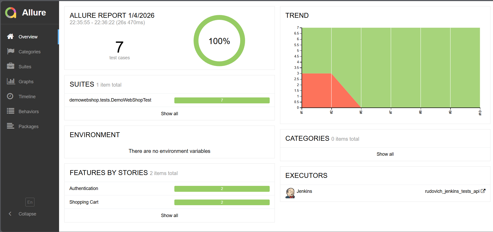
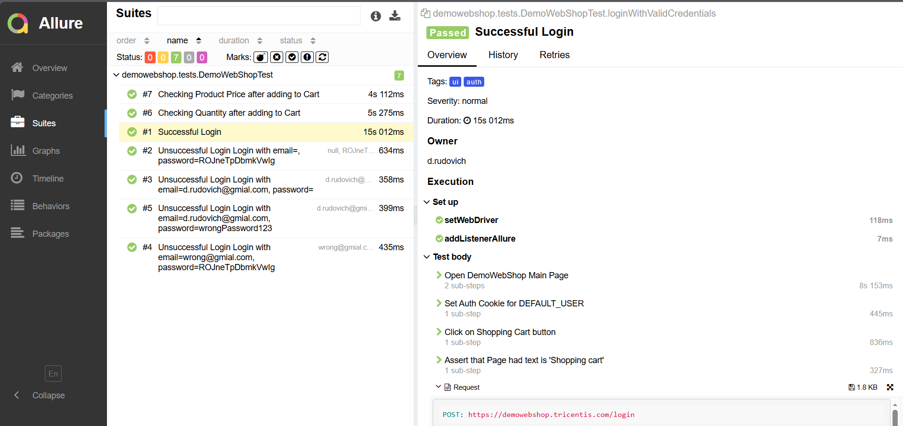

# Project: Automated Testing of Online Store [Demo Web Shop](https://demowebshop.tricentis.com/)

## :open_book: Table of Contents

- [Technologies and Tools](#gear-technologies-and-tools)
- [Test Cases](#heavy_check_mark-test-cases)
- [Running Tests](#computer-running-tests-from-terminal)
- [Running Tests in Jenkins](#running-tests-in-jenkins)
- [Allure Report](#allure-report)
- [Telegram Notifications](#telegram-notifications)

## :gear: Technologies and Tools

<p align="left">
<a href="https://www.jetbrains.com/idea/"></a>
<a href="https://www.java.com/"></a>
<a href="https://github.com/"></a>
<a href="https://junit.org/junit5/"></a>
<a href="https://gradle.org/"></a>
<a href="https://selenide.org/"></a>
<a href="https://rest-assured.io/"></a>
<a href="https://www.jenkins.io/"></a>
<a href="https://github.com/allure-framework/allure2"></a>
</p>

This project contains automated tests written in **Java** using **Selenide** for UI testing and **RestAssured** for API
testing.

**JUnit5** is used as the test framework, **Gradle** for build management, and **Allure** for reporting.  
Tests can be executed locally or remotely (e.g. via Selenoid).

## :heavy_check_mark: Test Cases

- Successful login with valid credentials 
- Unsuccessful login with invalid/empty credentials (parameterized test)
- Add product to cart and verify quantity
- Remove product from cart and verify empty state
- Add product to cart and verify price

## :computer: Running Tests from Terminal

### :house_with_garden: Local Test Execution

```bash
gradle clean test
```

### :earth_asia: Remote Test Execution

```bash
gradle clean test
-Dbrowser=${browser}
-DbrowserVersion=${browserVersion}
-DbrowserSize=${browserSize}
-DremoteDriverUrl={REMOTE_DRIVER_URL}
```

## Running Tests in Jenkins

* browser (default: chrome)
* browserVersion (default: 100.0)
* browserSize (default: 1920x1080)
* remoteDriverUrl (Selenoid URL)

##  Running Tests in [Jenkins](https://jenkins.autotests.cloud/job/030_rudovich_jenkins_tests_modsen/)

To start a build, go to <code><strong>Build with Parameters</strong></code> and click <code><strong>Build</strong></code>.

<p align="center">
  
</p>

## :allure: Report
##  Result of Testing in   [Allure Report](https://jenkins.autotests.cloud/job/015_aziyatdinov_final_ui/1/allure/)

<p align="center">
  
</p>

<p align="center">
  
</p>